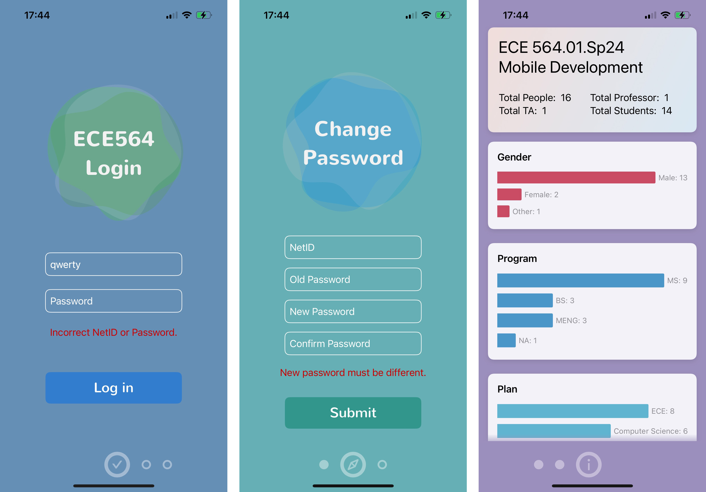

## ECE564: Mobile Development Spring 2024 Login Kit

This is the ```login``` module for Duke iOS Development course. Students need to embed this module in their projects to get the login and password update functionality.

**This module has no support for dark mode**

v0.1.1 update: Add haptic feedback, and fix secure text field issue.


### 0. Prerequisites
- Xcode 15.0+
- Swift 5.5+
- iOS 16.0+

### 1. Demo

This module has three pages:
- Login Page: 
    - Users can login with their Duke netID and password.
    - netID must be registered in the server database (TA has registered all students' netID).
- Password Update Page:
    - Users can update their password with existing password.
    - New password must be different from the existing password.
    - No restriction on the password format, but it is recommended to use a strong password (If someone messes up the server using your netID, then you have the responsibility).
- Statistics Page:
    - Users can see the statistics of class information.
    - **This page can also be used to check if the server is working properly.**

The module is fully animated. This is a good way you can get extra credit for your future homework.

<p align="center">
  
</p>

I only tested this module on iPhone 15 Pro, iPhone 13 Pro, and iPad 11 Inches, but it should work on all resolutions.

### 2. Installation
#### 2.1. Add this package to your project
Click "Add Package Dependencies" button in Xcode project browser view, and enter the following URL:
```
https://github.com/0HugoHu/ECE564Login
```

Choose "Dependency Rule": Branch - main, and click "Add Package".

#### 2.2. Add the module to your target
Click your project file (e.g. XXX.xcodeproj) in Xcode project browser view, and select your target. Then, click "Build Phrases" tab, and add "ECE564Login" to "Target Dependencies".

#### 2.3. Embed in code
#### 2.3.1. SwiftUI
If you are using SwiftUI, add the following code to embed the login module in your project's **highest level view** (e.g., ContentView.swift):
```swift
import ECE564Login

struct ContentView: View {
    var body: some View {
        // Add a ZStack to let the module overlay on your existing view
        ZStack {
            // Your Existing Code
            // ...

            // Add the following code to embed the login module
            // You have to add this code at the bottom of ZStack
            ECE564LoginView()
        }
    }
}
```

#### 2.3.2. UIKit
If you are using UIKit, add the following code to embed the login module in your project's **highest level view controller** (e.g., ViewController.swift):
```swift
import ECE564Login

class ViewController: UIViewController {
    // Add this ZStack to let the module overlay on your existing view
    private var zStack: UIView!

    override func viewDidLoad() {
        super.viewDidLoad()

        // Add the following code to embed the login module
        zStack = UIView(frame: view.bounds)
        let swiftUIView = ECE564Login()
        let hostingController = UIHostingController(rootView: swiftUIView)
        hostingController.view.frame = view.bounds
        hostingController.view.backgroundColor = .clear

        // Your Existing Code
        // ...

        // Add all your other views to the zStack
        // zStack.addSubview(...)

        // Finally add the login module to the zStack
        zStack.addSubview(hostingController.view)
        // Be sure zStack is the only subview in the view
        view.addSubview(zStack)
    }
}
```

I have tested on both SwiftUI and your hw UIKit project, so I hope this works. Feel free to contact me if you have any questions.

### 3. Warnings
This module is to provide you a way for simple password management, and let TAs to login to different students' accounts for grading.

You don't need to necessarily know the technical details, and you can go to check the source code on how I implement these features. But, **you should never use the ```fakeAuth``` and try to hack the server.**


### 4. How it works
This module is a standalone module, so you can simply embed it in your project with no need to copy resources or modify your existing code.

#### 4.1. How this view disappears after successfully logged-in?
I set a listener on the ```AuthString``` key in ```UserDefaults```, and the login view will not show up if the value is not empty. Therefore, after successfully logged in, you can get your current account token in ```netID:Password``` String format from this key.

#### 4.2. How to check the password?
At launch, I download all students' info, and check if the ```netID``` exists, and if so, I send a ```PUT``` request to test if I can update the user's info. If the server returns ```200 OK```, then the password is correct.

#### 4.3. How to update the status of loading button?
I set timers when the user clicks the login button, it fetches the the variable's value regularly from my data model, and update the button's status accordingly.

#### 4.4 How to use achieve the animations?
For the bubble-like animation, I use the ```Lottie``` library from ```Airbnb```. It loads the JSON-style animation file and plays it in the view. For the loading button, text animations, and page switching animations, go to check the source code.


### 5. LICENSE
This module is under the MIT License. You can use it in your project, but you should not use it for commercial purposes. If you have any questions, please contact me at ```0@hugohu.top```.


